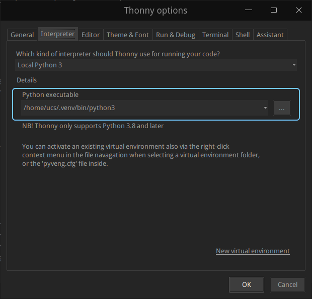

# Linux环境下Thonny使用虚拟环境venv

在较新的 Linux 系统（如 Ubuntu 23.04+、Debian 12+ 等）中，使用 `sudo pip` 安装包时出现 `externally-managed-environment` 错误，是因为系统启用了 “外部管理环境” 机制，禁止直接修改系统级 Python 环境（避免破坏系统依赖）。

### 解决方法：推荐使用虚拟环境（最佳实践）

#### 1. 创建并激活 Python 虚拟环境

bash

```Bash
# 安装 Python 虚拟环境工具（如果未安装）
sudo apt install python3-venv

# 创建虚拟环境（在当前目录下生成一个 .venv 文件夹）
python3 -m venv .venv

# 激活虚拟环境
source .venv/bin/activate
```

激活后，终端提示符前会显示 `(.venv)`，表示当前处于虚拟环境中。

#### 2. 在虚拟环境中安装依赖

bash

```Bash
# 此时无需 sudo，直接用 pip 安装
pip install pyqtgraph pyqt5 pyserial numpy
```

#### 3. 运行程序

在虚拟环境激活状态下，直接运行 Python 脚本即可正常引用安装的库：

bash

```Bash
python your_script.py  # 替换为你的示波器脚本文件名
```

#### 4. 退出虚拟环境（可选）

bash

```Bash
deactivate
```

### 其他可选方法（不推荐，可能影响系统稳定性）

如果确实需要全局安装（不建议），可通过 `--break-system-packages` 强制绕过限制：

bash

```Bash
sudo pip3 install pyqtgraph pyqt5 pyserial numpy --break-system-packages
```

⚠️ 注意：此方法可能导致系统 Python 依赖冲突，仅临时测试时使用。

#### 5.在Thonny中使用虚拟环境

在thonny的Tools -> Options -> Interpreter中选择.venv/bin/python3



### 原理说明

- 新 Linux 系统通过 `/usr/lib/python3.x/EXTERNALLY-MANAGED` 文件启用环境保护，禁止 `pip` 直接修改系统级 Python 库。
- 虚拟环境会在当前目录创建独立的 Python 环境，所有库安装在其中，不影响系统全局配置，是安全且推荐的做法。

按照虚拟环境的步骤操作，既能避免错误，又能保证开发环境的隔离性。